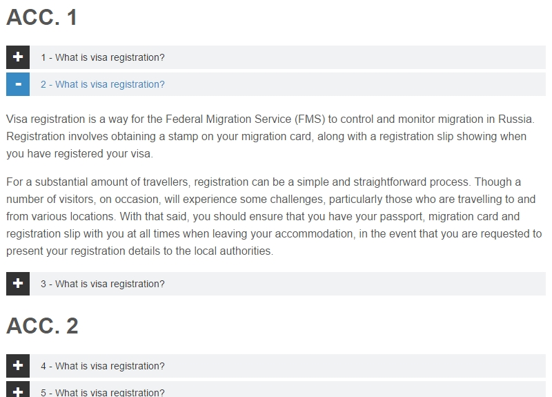

# Accordion
Accordion, jQuery

### Структура аккордиона:
	div.accordion
	  h3
	  div
	    -content-

То есть аккордион распознается по классу, а значит таких элементов на странице может быть несколько.

Одновременно может быть развернута только одна секция во всех блоках.

При клике на h3 плавно разворачивается находящийся под ней div (увеличивается его высота с 0 до размера заключенного в нем контента), после чего страница прокручивается до заголовка, по которому кликнули - это нужно для того, чтобы контент не "улетал" вверх.

***

